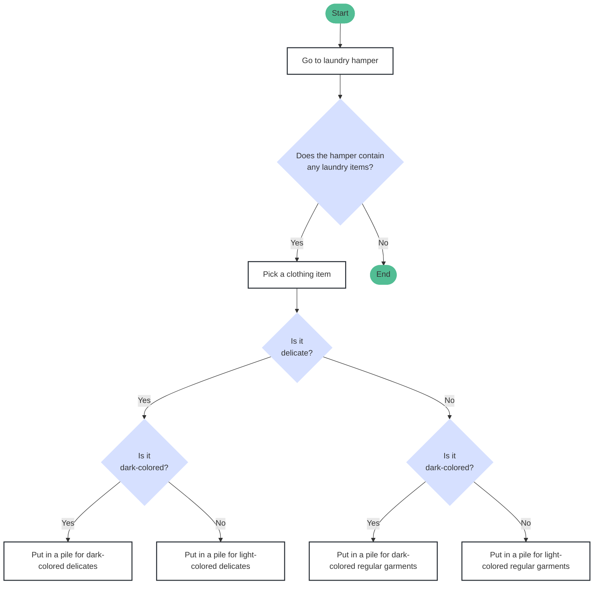

# How to Sort Your Laundry
> **_NOTE:_**  For simplicity's sake, the following flowchart assumes your laundry contains only clothing items. Towels, bedding, and other laundry items are excluded from this flowchart.

